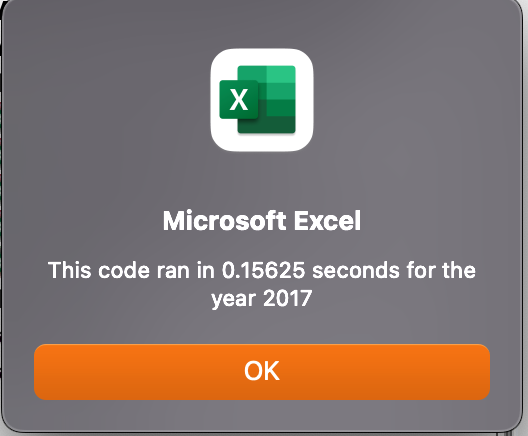
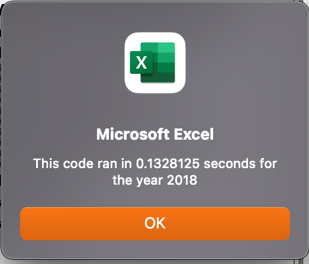

# Module 2 Challenge Analysis 
## by Crystina Dang
### VBA Challenge: Written Analysis of Results

## Overview of Project:

The purpose of this project was to refactor the code produced in Module 2. In this challenge, the exact same results are produced using code that is more efficient by reducing steps, using less memory, or improving the logic for ease of reading.

## Results: 

### Code Differences:

**Compared to the original code, the ticker array was handled by providing an additional variable, a ticker Index:
```
'1a) Create a ticker Index
    'tickerIndex created to start at 0 as arrays begin at 0, and an increase at the end of the loop will allow the entire array to be completed
    tickerIndex = 0
```


**The ticker Index was set to 0 as the array begins at 0 and will continue to the set limit determined by:
```
    '1b) Create three output arrays
    'Dim defines that the outputs will be an array and the number defines the end
    Dim tickerVolumes(11) As Long
    Dim tickerStartingPrices(11) As Single
    Dim tickerEndingPrices(11) As Single
```


**Setting every output to 0 will reset number whenever a new loop starts:
    
```
    ''2a) Create a for loop to initialize the tickerVolumes to zero.
    'tickerStartingPrices and tickerEndingPrices set to 0 as well to not carry over stored number from previous array
    For i = 0 To 11
        tickerVolumes(i) = 0
        tickerStartingPrices(i) = 0
        tickerEndingPrices(i) = 0
    Next i
    ''2b) Loop over all the rows in the spreadsheet.
    For j = 2 To RowCount
```


**By providing this additional variable, each formula is made be similiar and easier to read:

```
        '3a) Increase volume for current ticker
        'this will capture the Volumes column increased from the initial zero
        tickerVolumes(tickerIndex) = tickerVolumes(tickerIndex) + Cells(j, 8).Value
        
        '3b) Check if the current row is the first row with the selected tickerIndex.
        'If  Then
        If Cells(j, 1).Value = tickers(tickerIndex) And Cells(j - 1, 1).Value <> tickers(tickerIndex) Then
                tickerStartingPrices(tickerIndex) = Cells(j, 6).Value
        
        End If
        
        '3c) check if the current row is the last row with the selected ticker
         'If the next row’s ticker doesn’t match, increase the tickerIndex.
        'If  Then
        If Cells(j, 1).Value = tickers(tickerIndex) And Cells(j + 1, 1).Value <> tickers(tickerIndex) Then
                tickerEndingPrices(tickerIndex) = Cells(j, 6).Value
            
        End If
```


**By adding an If statement that increasing the ticker Index after each completed loop, thet next ticker's information will be completed in the next loop:

```
            '3d Increase the tickerIndex.
            'adding to the tickerIndex progresses to the next number in the array to continue the loop through all ticker types
        If Cells(j, 1).Value = tickers(tickerIndex) And Cells(j + 1, 1).Value <> tickers(tickerIndex) Then
            tickerIndex = tickerIndex + 1
        
        End If

        Next j
 ```

 
 ```
    '4) Loop through your arrays to output the Ticker, Total Daily Volume, and Return.
    For i = 0 To 11
        Worksheets("all_stocks_analysis").Activate
        
        Cells(4 + i, 1).Value = tickers(i)
        Cells(4 + i, 2).Value = tickerVolumes(i)
        Cells(4 + i, 3).Value = tickerEndingPrices(i) / tickerStartingPrices(i) - 1
```
*Formatting was completed in the starter code.

### Refactored Results:

Below are images of the speed of the code before being refactored:


Below are images of the speed of the code when the code was refactored:





In summary, the seemingly minute differences in code reduced the speed by over half which could mean significant savings in time, memory, and use of code.

### Green Stocks Decisions:

*Below are the images of the results of 2017 and 2018's stocks: 


The charts presents the case that though most of the stocks did well in 2017, only ENPH and RUN have a second year of positive returns.


## Summary:

### 1. What are the advantages or disadvantages of refactoring code?
The advantage of refactoring is 

### 2. How do these pros and cons apply to refactoring the original VBA script?


